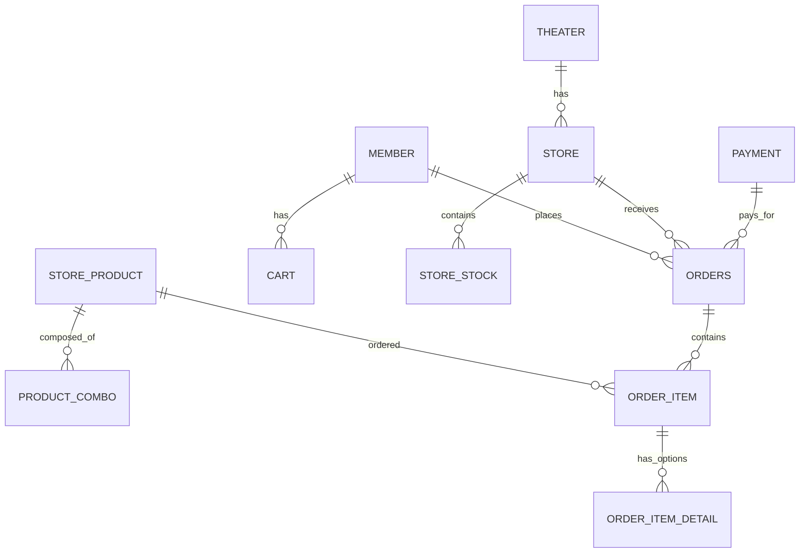
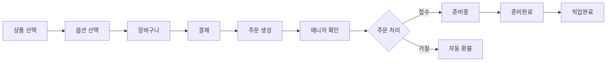

# 🎬 All Movie

## 📌 프로젝트 개요

영화 예매와 매점 주문을 통합한 웹 애플리케이션입니다.

- **목적**
  영화관 이용객의 관람/예매 경험을 개선하고,
  관리자 및 직원이 효율적으로 운영할 수 있는 관리 기능을 제공하는 것을 목표로 합니다.
  사용자는 영화 정보를 얻고 영화를 예매하거나 매점에서 음식을 비대면으로 주문할 수 있으며, 매니저는 주문을 실시간으로 관리할 수 있습니다.
  영화나 매점에 관한 공지사항, 1:1 문의, 그리고 영화관 대관/단체 관람 문의가 가능합니다.
- **기획 배경**
  최근 OTT 서비스 확산과 관람 문화 변화로 인해
  영화관 산업 전반이 침체되고 있는 상황에서,
  영화관의 경험적 가치를 보완할 수 있는 웹 서비스를 기획하였습니다.
- **대상 사용자**
  - 영화관 이용객
  - 영화관 관리자 및 매니저
- **총 개발 기간**: 2025.12.15 ~ 2026.01.30

**배포 URL**: [https://sist-all-movie.duckdns.org](https://sist-all-movie.duckdns.org)

## 🛠 기술 스택

### Backend

- **Java 17**
- **Spring Boot 3.5.10**
- **Oracle Database 21C** - 메인 데이터베이스
- **MyBatis**
- **REST API**
- **WebSocket (STOMP)** - 실시간 양방향 통신

### Frontend

- **Vue.js 3** - CDN 방식, JSP 내 구성
- **Pinia** - 전역 상태 관리
- **JSP** - 서버 사이드 렌더링
- **Bootstrap** - UI 프레임워크
- **Axios** - HTTP 클라이언트

### DevOps

- **AWS EC2** - 서버 호스팅
- **Jenkins** - CI/CD 자동화
- **Ubuntu 22.04** - Jenkins 로컬 서버
- **ngrok** - 로컬 서버 무료 도메인
- **Nginx** - 리버스 프록시 & 로드 밸런서
- **Let's Encrypt** - SSL/TLS 인증서
- **DuckDNS** - AWS 서버 무료 도메인

### Payment

- **KG Inicis** - PG사
- **Iamport** - 결제 통합 API

## 📌 프로젝트 특징

- JSP 환경에서 Vue(CDN) + Pinia를 결합하여 점진적으로 SPA 구조를 구성
- 프런트엔드 상태를 Pinia 스토어로 통합 관리하여 컴포넌트 간 데이터 전달 구조 개선
- 프런트엔드와 백엔드 분리 구조(Spring REST API)로 역할 분담 명확화
- 영화 스케줄, 좌석 정보 등 사용자 선택에 따라 동적으로 변경되는 UI 구현

## 🧠 기술적 경험

- Vue(CDN) + Pinia를 사용해 JSP 환경에서도 전역 상태 관리 구조 설계
- 프런트엔드에서 사용자 편의에 맞게 데이터 가공,  
  백엔드에서는 검증 및 비즈니스 로직 처리
- REST API 기반으로 프런트엔드-백엔드 분리 아키텍처 경험
- Jenkins를 이용한 빌드 및 배포 자동화(CI/CD 파이프라인 구성)

## ✨ 주요 기능

### 1. 사용자 기능

#### 영화 정보

- 영화 목록 조회 (Trending, Popular, Recent)
- 영화 상세 정보 확인
- 영화 리뷰 댓글 작성 및 조회

#### 영화 예매

- 지역 및 영화관 선택
- 상영 스케줄 조회
- 좌석 선택 및 예매
- 좌석 중복 예매 방지 로직
- 실시간 결제 (KG Inicis + Iamport)
- 마이페이지 내 예매 관리

#### 매점 주문

- 매점 상품 조회 (단품/콤보)
- 상품 상세 및 옵션 선택
- 장바구니 기능
- 실시간 결제 (KG Inicis + Iamport)
- 주문 현황 실시간 모니터링

#### 위치 기반 서비스

- Geolocation API를 통한 현재 위치 파악
- 가까운 매점 검색 (Haversine 공식)
- 거리순 정렬

#### 주문 추적

- 실시간 주문 상태 확인
- WebSocket을 통한 푸시 알림

#### 고객센터

- 공지사항 조회
- 1:1 문의 조회/작성/수정/삭제
- 대관/단체 문의 조회/작성/수정/삭제

### 2. 매니저 기능

#### 재고 관리

- 매장별 재고 조회
- 재고 수량 업데이트
- 상품 등록 (단품/콤보)

#### 주문 관리

- 실시간 주문 수신 알림
- 주문 상태 관리
  - `received` → `preparing` → `ready` → `completed`
  - `rejected` (자동 환불)
- 오늘의 주문 통계 대시보드
- 30초 자동 새로고침 (WebSocket)

### 3. 관리자 기능

#### 고객센터 관리

- 공지사항 조회/작성/수정/삭제
- 1:1 문의 조회 및 답변
- 대관/단체 문의 조회 및 답변

## 🗄 데이터베이스 설계

### 주요 테이블

#### 회원 및 극장

- `member` - 회원 정보
- `theater` - 극장 정보 (위도/경도 포함)
- `store` - 매장 정보

#### 상품 관리

- `product_category` - 상품 카테고리
- `product_item` - 모든 식품 아이템
- `store_product` - 판매 상품
- `product_combo` - 콤보 구성
- `store_stock` - 재고

#### 주문 및 결제

- `payment` - 결제 정보
- `orders` - 주문 정보
- `order_item` - 주문 상품
- `order_item_detail` - 주문 상품 옵션

#### 장바구니

- `cart` - 장바구니
- `cart_item` - 장바구니 상품 옵션

### ER Diagram



---

## API 설계

**MainController**
| Method | URL | 설명 |
| --- | - | ---------- |
| GET | / | 메인 페이지 |

**MainRestController**
| Method | URL | 설명 |
| ------ | ---------------------- | ---------------- |
|GET|/main/list_vue|메인페이지 목록 조회|

**MemberController**
| Method | URL | 설명 |
| ------ | ---------------------- | ---------------- |
| GET | /member/login | 로그인 페이지 |
| POST | /member/login | 로그인 |
| POST | /member/logout | 로그아웃 |
| GET | /member/join | 회원가입 페이지 |
| POST | /member/join_ok | 회원가입 |
| GET | /member/mypage | 마이페이지 |
| GET | /mypage/order/tracking | 주문 추적 페이지 |

**MemberRestController**
| Method | URL | 설명 |
| ------ | -------------------------------------- | ---------------- |
| GET | /member/idCheck_vue/?user_id={user_id} | 아이디 중복 확인 |
| GET | /mypage/bookingListData | 예약 목록 확인 |
| PATCH | /mypage/bookingCancel | 예약 취소 |
| GET | /member/info | 회원 정보 조회 |

**MovieController**
| Method | URL | 설명 |
| ------ | ---------------------- | ---------------- |
| GET | /movie/list?page={page} | 영화 목록 페이지 |
| GET | /movie/detail?movie-id={movie-id} | 영화 상세 페이지 |

**ReviewRestController**
| Method | URL | 설명 |
| ------ | ---------------------- | ---------------- |
|GET|/review/movie/list?movie-id={movie-id}|영화 리뷰 조회|
|POST|/review/movie/insert|영화 리뷰 작성|

**BookingController**
| Method | URL | 설명 |
| ------ | ---------------------- | ---------------- |
|GET|/booking|영화 예매 페이지|
|POST|/booking/seat?id={id}|영화 예매 좌석 선택 페이지|

**BookingRestController**
| Method | URL | 설명 |
| ------ | --- | ---- |
|POST|/booking/data/|영화 예매 가능 목록 조회|
|POST|/seat/data|영화 예매 가능 좌석 조회|
|POST|/seat/booking_info|영화 예매 일정, 가격 조회|
|POST|/seat/validation|영화 예매 좌석 검증|
|POST|/seat/booking_seat|영화 예매 좌석 선택|
|POST|/seat/booking_cancel|영화 예매 취소|
|POST|/booking/complete|영화 예매 완료|

**StoreController**
| Method | URL | 설명 |
| ------ | --- | ---- |

**StoreRestController**
| Method | URL | 설명 |
| ------ | --- | ---- |

**StockRestController**
| Method | URL | 설명 |
| ------ | --- | ---- |

**CartRestController**
| Method | URL | 설명 |
| ------ | --- | ---- |

**OrderRestController**
| Method | URL | 설명 |
| ------ | --- | ---- |

**PaymentRestController**
| Method | URL | 설명 |
| ------ | --- | ---- |

**ProductRestController**
| Method | URL | 설명 |
| ------ | --- | ---- |

**ManagerOrderRestController**
| Method | URL | 설명 |
| ------ | --- | ---- |

**BoardController**
| Method | URL | 설명 |
| ------ | --- | ---- |

**BoardRestController**
| Method | URL | 설명 |
| ------ | --- | ---- |

**HelpdeskController**
| Method | URL | 설명 |
| ------ | --- | ---- |

**GroupvisitController**
| Method | URL | 설명 |
| ------ | --- | ---- |

---

## 🔄 주문 플로우



## 🚀 배포 아키텍처

```
사용자
  ↓
DuckDNS (sist-all-movie.duckdns.org)
  ↓
AWS Route 53 (DNS)
  ↓
Let's Encrypt (SSL/TLS)
  ↓
Nginx (443 → 8000 프록시)
  ↓
Spring Boot (8000 포트)
  ↓
Oracle Database
```

### 보안 설정

- **HTTPS 강제** (Let's Encrypt)
- **Nginx 리버스 프록시**
- **Spring Security**

## 🔐 보안 및 최적화

### 구현된 보안 기능

- HTTPS 적용 (Let's Encrypt)
- CSRF 방어
- XSS 방어 (HttpOnly 쿠키)
- SQL Injection 방어 (MyBatis)
- 결제 금액 서버 검증

### 성능 최적화

- **N+1 쿼리 해결** (MyBatis XML JOIN)
- **WebSocket 실시간 통신** (폴링 제거)

### 개선 필요 사항

- [ ] Spring Security와 JWT를 적용해 사용자 인증 기반 기능 구현
- [ ] Spring Security 적용을 통한 사용자 인증 및 권한 처리
- [ ] 프런트엔드 캐싱 전략 개선
- [ ] 좌석 선택 알고리즘 개선
- [ ] 재고 동시성 제어 (낙관적 락)
- [ ] Redis 캐싱 도입
- [ ] 단위 테스트 작성

## 📦 설치 및 실행

### 사전 요구사항

- Java 17 이상
- Oracle Database 21c
- Gradle 8.x

### 로컬 실행

```bash
# 1. 저장소 클론
git clone https://github.com/AllMovieProject/AllMovieProject.git
cd AllMovieProject

# 2. 데이터베이스 설정
# application.properties 수정
spring.datasource.url=jdbc:oracle:thin:@localhost:1521:xe
spring.datasource.username=your_username
spring.datasource.password=your_password

# 3. 빌드 및 실행
./gradlew clean build
./gradlew bootRun

# 4. 접속
http://localhost:8000
```

## 👥 팀원

| 이름   | 역할       | GitHub                                  |
| ------ | ---------- | --------------------------------------- |
| 전성환 | Full Stack | [Github](https://github.com/masterjeon) |
| 신재화 | Full Stack | [Github](https://github.com/necteo)     |
| 손다솔 | Full Stack | [Github](https://github.com/dasolson)   |

## 📸 포트폴리오

> https://www.canva.com/design/DAG7Jyysa44/uqUZ8wVXx6HmIn4OHa6XNw/edit?utm_content=DAG7Jyysa44&utm_campaign=designshare&utm_medium=link2&utm_source=sharebutton
