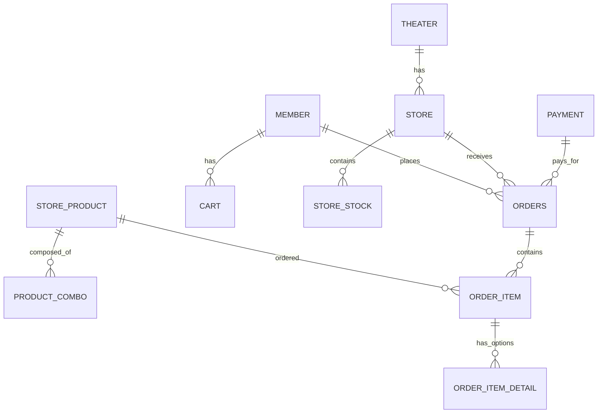
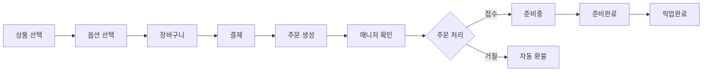

# 🎬 All Movie - 영화 예매 및 매점 통합 시스템

## 📌 프로젝트 개요

영화 예매와 매점 주문을 통합한 웹 애플리케이션입니다.

사용자는 영화 정보를 얻고 영화를 예매하거나 매점에서 음식을 비대면으로 주문할 수 있으며, 매니저는 주문을 실시간으로 관리할 수 있습니다.

영화나 매점에 관한 공지사항, 1:1 문의, 그리고 영화관 대관/단체 관람 문의가 가능합니다.

**배포 URL**: [https://sist-all-movie.duckdns.org](https://sist-all-movie.duckdns.org)

## 🛠 기술 스택

### Backend

- **Java 17**
- **Spring Boot 3.5.10**
- **MyBatis**
- **Oracle Database** - 메인 데이터베이스
- **WebSocket (STOMP)** - 실시간 양방향 통신

### Frontend

- **Vue.js 3** - 프론트엔드 프레임워크
- **Pinia** - 상태 관리
- **JSP** - 서버 사이드 렌더링
- **Bootstrap** - UI 프레임워크
- **Axios** - HTTP 클라이언트

### DevOps

- **AWS EC2** - 서버 호스팅
- **Jenkins** - CI/CD 자동화
- **Ubuntu 22.04** - Jenkins 로컬 서버
- **ngrok** - 로컬 서버 무료 도메인
- **Nginx** - 리버스 프록시 & 로드 밸런서
- **Let's Encrypt** - SSL/TLS 인증서
- **DuckDNS** - AWS 서버 무료 도메인

### Payment

- **KG Inicis** - PG사
- **Iamport** - 결제 통합 API

## ✨ 주요 기능

### 1. 사용자 기능

#### 영화 정보

- 영화 목록 조회 (Trending, Popular, Recent)
- 영화 상세 정보 확인
- 영화 리뷰 댓글 작성 및 조회

#### 영화 예매

- 영화 예매 시 날짜 및 극장 검증
- 실시간 결제 (KG Inicis + Iamport)

#### 매점 주문

- 매점 상품 조회 (단품/콤보)
- 상품 상세 및 옵션 선택
- 장바구니 기능
- 실시간 결제 (KG Inicis + Iamport)
- 주문 현황 실시간 모니터링

#### 위치 기반 서비스

- Geolocation API를 통한 현재 위치 파악
- 가까운 매점 검색 (Haversine 공식)
- 거리순 정렬

#### 주문 추적

- 실시간 주문 상태 확인
- WebSocket을 통한 푸시 알림

### 2. 매니저 기능

#### 재고 관리

- 매장별 재고 조회
- 재고 수량 업데이트
- 상품 등록 (단품/콤보)

#### 주문 관리

- 실시간 주문 수신 알림
- 주문 상태 관리
  - `received` → `preparing` → `ready` → `completed`
  - `rejected` (자동 환불)
- 오늘의 주문 통계 대시보드
- 30초 자동 새로고침 (WebSocket)

## 🗄 데이터베이스 설계

### 주요 테이블

#### 회원 및 극장

- `member` - 회원 정보
- `theater` - 극장 정보 (위도/경도 포함)
- `store` - 매장 정보

#### 상품 관리

- `product_category` - 상품 카테고리
- `product_item` - 모든 식품 아이템
- `store_product` - 판매 상품
- `product_combo` - 콤보 구성
- `store_stock` - 재고

#### 주문 및 결제

- `payment` - 결제 정보
- `orders` - 주문 정보
- `order_item` - 주문 상품
- `order_item_detail` - 주문 상품 옵션

#### 장바구니

- `cart` - 장바구니
- `cart_item` - 장바구니 상품 옵션

### ER Diagram



## 🔄 주문 플로우



## 🚀 배포 아키텍처

```
사용자
  ↓
DuckDNS (sist-all-movie.duckdns.org)
  ↓
AWS Route 53 (DNS)
  ↓
Let's Encrypt (SSL/TLS)
  ↓
Nginx (443 → 8000 프록시)
  ↓
Spring Boot (8000 포트)
  ↓
Oracle Database
```

### 보안 설정

- **HTTPS 강제** (Let's Encrypt)
- **Nginx 리버스 프록시**
- **Spring Security**

## 🔐 보안 및 최적화

### 구현된 보안 기능

- HTTPS 적용 (Let's Encrypt)
- CSRF 방어
- XSS 방어 (HttpOnly 쿠키)
- SQL Injection 방어 (MyBatis)
- 결제 금액 서버 검증

### 성능 최적화

- **N+1 쿼리 해결** (MyBatis XML JOIN)
- **WebSocket 실시간 통신** (폴링 제거)

### 개선 필요 사항

- [ ] 재고 동시성 제어 (낙관적 락)
- [ ] Redis 캐싱 도입
- [ ] 단위 테스트 작성
- [ ] 로깅 체계 구축 (ELK Stack)

## 📦 설치 및 실행

### 사전 요구사항

- Java 17 이상
- Oracle Database
- Gradle 8.x

### 로컬 실행

```bash
# 1. 저장소 클론
git clone https://github.com/AllMovieProject/AllMovieProject.git
cd AllMovieProject

# 2. 데이터베이스 설정
# application.properties 수정
spring.datasource.url=jdbc:oracle:thin:@localhost:1521:xe
spring.datasource.username=your_username
spring.datasource.password=your_password

# 3. 빌드 및 실행
./gradlew clean build
./gradlew bootRun

# 4. 접속
http://localhost:8000
```

## 🌐 프로덕션 배포

### AWS EC2 배포

```bash
# 1. EC2 인스턴스 생성 (Ubuntu 24.04)

# 2. 필수 패키지 설치
sudo apt update
sudo apt install openjdk-17-jdk nginx certbot python3-certbot-nginx -y

# 3. 애플리케이션 배포
scp build/libs/*.war ubuntu@your-server:/home/ubuntu/app/app.war

# 4. Nginx 설정
sudo nano /etc/nginx/sites-available/default
# (Nginx 설정 추가)

# 5. Let's Encrypt 인증서 발급
sudo certbot --nginx -d your-domain.duckdns.org

# 6. 애플리케이션 실행
nohup java -jar /home/ubuntu/app/app.war > /home/ubuntu/app/app.log 2>&1 &
```

### Jenkins CI/CD

```groovy
pipeline {
    agent any

    stages {
        stage('Build') {
            steps {
                sh './gradlew clean build -x test'
            }
        }

        stage('Deploy') {
            steps {
                sshagent(['ec2-ssh-key']) {
                    sh '''
                        scp build/libs/*.war ubuntu@your-server:/home/ubuntu/app/
                        ssh ubuntu@your-server 'pkill -f app.jar || true'
                        ssh ubuntu@your-server 'nohup java -jar /home/ubuntu/app/app.jar &'
                    '''
                }
            }
        }
    }
}
```

## 🧪 테스트

### Geolocation API 테스트

```javascript
// 브라우저 콘솔 (F12)
navigator.geolocation.getCurrentPosition(
	(pos) =>
		console.log('위도:', pos.coords.latitude, '경도:', pos.coords.longitude),
	(err) => console.error('에러:', err.message),
);
```

### WebSocket 연결 테스트

```javascript
// 브라우저 콘솔
const socket = new SockJS('https://sist-all-movie.duckdns.org/ws');
const stompClient = Stomp.over(socket);
stompClient.connect({}, () => {
	console.log('WebSocket 연결 성공');
});
```

## 📊 프로젝트 통계

- **총 개발 기간**: X주
- **총 코드 라인**: ~XX,XXX lines
- **API 엔드포인트**: XX개
- **데이터베이스 테이블**: 15개

## 👥 팀원

| 이름   | 역할       | GitHub                                  |
| ------ | ---------- | --------------------------------------- |
| 전성환 | Full Stack | [Github](https://github.com/masterchun) |
| 신재화 | Full Stack | [Github](https://github.com/necteo)     |
| 손다솔 | Frontend   | [Github](https://github.com/dasolson)   |

## 🙏 감사의 말

- Spring Boot 커뮤니티
- Vue.js 커뮤니티
- Let's Encrypt
- DuckDNS
